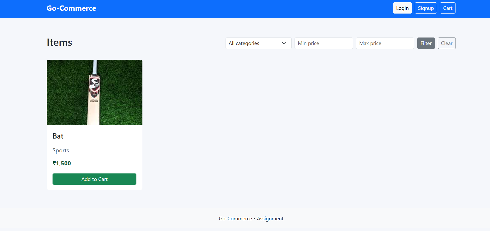
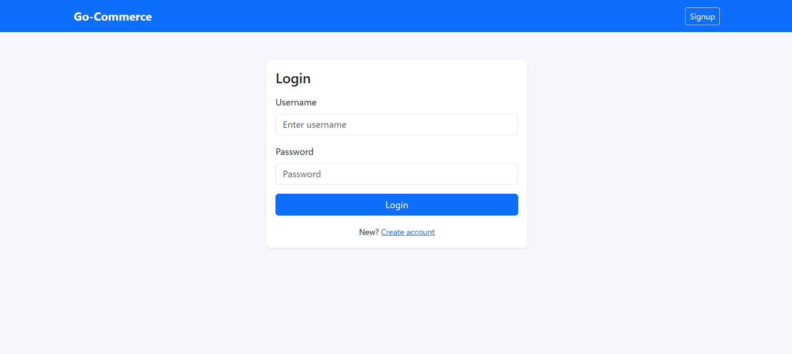
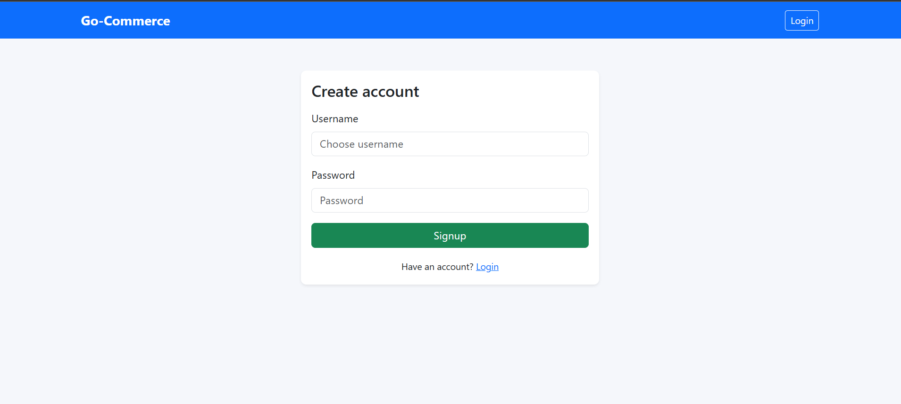
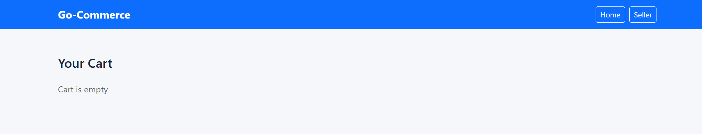
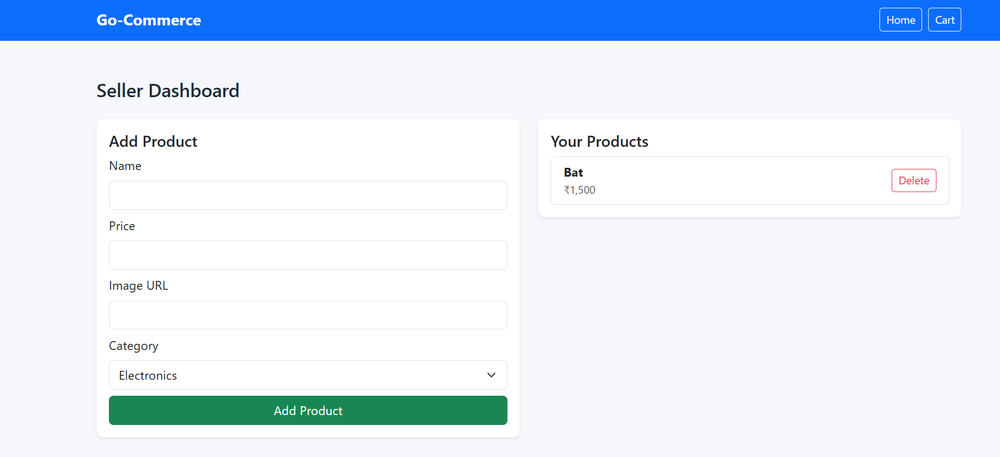

# E-Commerce Web Application

A multi-page e-commerce web application built as a short assignment for an internship.  

This project demonstrates full-stack development using **Go (Golang) backend**, **MySQL database**, and a **Vanilla JS frontend**. It supports authentication, item management, and cart functionality.

---

## Tech Stack

- **Backend:** Go (Golang)  
- **Database:** MySQL  
- **Authentication:** JWT (JSON Web Tokens)  
- **Frontend:** HTML, CSS, JavaScript (Vanilla)  
- **APIs:** RESTful endpoints for authentication, items, and cart  

---

## Features

- **Authentication:** Signup and login using JWT  
- **Item Management (CRUD):** List, create, update, and delete items  
- **Filtering:** Filter items by category and price  
- **Cart:**  
  - Add items to cart  
  - Remove items from cart  
  - Cart persists for logged-in users  

---

## Screenshots

### Home Page


### Login Page


### Signup Page


### Cart Page


### Seller Dashboard


> *Add your screenshots in the `screenshots/` folder and replace the paths above.*

---

## Setup Instructions

### Backend

1. Install Go: https://golang.org/doc/install  
2. Setup MySQL database:

```sql
CREATE DATABASE ecommerce;
Configure .env file in backend root:
MYSQL_DSN=root:YourPassword@tcp(127.0.0.1:3306)/ecommerce?parseTime=true
JWT_SECRET=your_long_and_random_jwt_secret_key_here
ALLOWED_ORIGINS=http://localhost:8000
Run backend:
go run main.go
Frontend

Open the frontend folder.

Serve files using any static server (e.g., VS Code Live Server) or open index.html in your browser.

API Endpoints

Auth: /signup, /login

Items: /items (GET, POST, DELETE, with filters)

Cart: /cart (GET, POST /add)

All APIs use JWT authentication where required.

Notes

Currently, the app is not deployed live. You can run it locally following the setup instructions.

Cart data persists in MySQL for logged-in users.

All required features for the assignment have been implemented.
